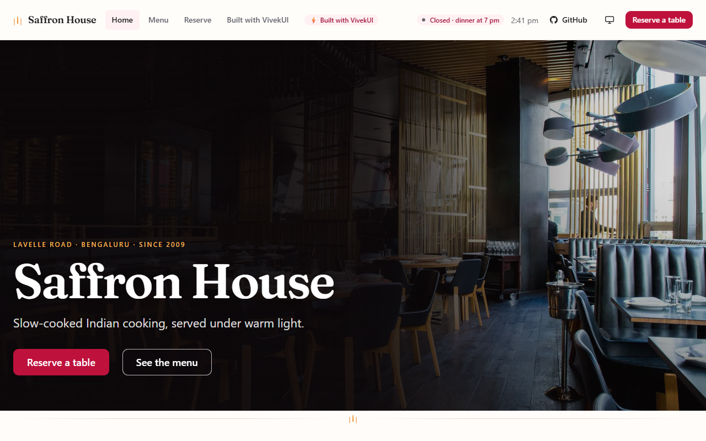
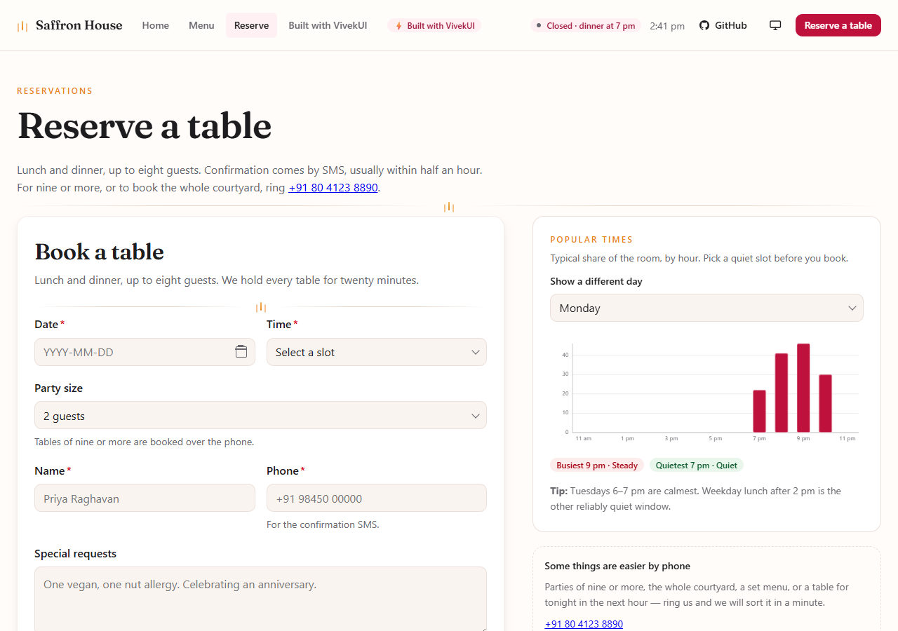

<div align="center">

# Saffron House

**A free, open-source restaurant website template for Next.js 16 — with online table reservations, a full menu, and a Google-style popular-times chart.**

Built entirely with [VivekUI](https://ui.vivekkumarsingh.in/docs?utm_source=vivekui-template&utm_campaign=restaurant&utm_medium=readme): 91 React components, 6 SVG charts, zero runtime dependencies.

[](https://saffronhouse.vivekkumarsingh.in)
[](https://nextjs.org)
[](https://react.dev)
[](https://www.typescriptlang.org)
[](https://www.npmjs.com/package/@the_viveksingh/vivek-ui)
[](#no-css-framework-no-chart-library)
[](./LICENSE)
[](https://github.com/intellectwithvivek/Saffron-House/stargazers)

### [**View the live demo →**](https://saffronhouse.vivekkumarsingh.in)

```bash
git clone https://github.com/intellectwithvivek/Saffron-House.git
```

[Use this template](https://github.com/intellectwithvivek/Saffron-House/generate) · [Deploy to Vercel](https://vercel.com/new/clone?repository-url=https%3A%2F%2Fgithub.com%2Fintellectwithvivek%2FSaffron-House&project-name=saffron-house&repository-name=saffron-house) · [Report an issue](https://github.com/intellectwithvivek/Saffron-House/issues) · [VivekUI docs](https://ui.vivekkumarsingh.in/docs?utm_source=vivekui-template&utm_campaign=restaurant&utm_medium=readme)



</div>

---

## What this is

A complete, production-quality four-page restaurant site you can fork, re-word and ship
today. Not a landing page full of lorem ipsum — every dish has a real description, the
opening hours drive a live open/closed badge, and the reservation form has the states a
real one needs: sold-out slots, party-size limits, blocked past dates and a confirmation
step.

It is also a showcase. Every component on the page comes from
[VivekUI](https://github.com/intellectwithvivek/vivek_UI), and `/built-with` maps each
section of the site to the component behind it, deep-linked to its documentation.

| Route | What is on it |
|---|---|
| `/` | Hero, the kitchen's story, a signature-dish carousel, a menu preview, a bento gallery, stats, reviews, FAQ, hours and a map |
| `/menu` | All 41 dishes across four courses, with prices, dietary markers and an allergen notice |
| `/reserve` | The booking form beside a **popular-times bar chart** that follows the date you pick |
| `/built-with` | Every section mapped to the VivekUI component behind it, deep-linked to its docs |

<div align="center">

</div>

## Quick start

```bash
# 1. Clone
git clone https://github.com/intellectwithvivek/Saffron-House.git
cd Saffron-House

# 2. Install
npm install

# 3. Run
npm run dev
```

Open <http://localhost:3000>. Requires **Node.js 20.9+** (22 LTS recommended).

```bash
npm run build      # production build
npm run start      # serve the build
npm run lint       # eslint
npm run typecheck  # tsc --noEmit
```

## Deploy

[](https://vercel.com/new/clone?repository-url=https%3A%2F%2Fgithub.com%2Fintellectwithvivek%2FSaffron-House&project-name=saffron-house&repository-name=saffron-house)

Every route is statically prerendered, so it also runs on Netlify, Cloudflare Pages, or
any static host. If you deploy to your own domain, change `SITE_URL` in
[`data/site.ts`](./data/site.ts) — the metadata, canonicals, sitemap, robots rules and
JSON-LD all read from it.

## Highlights

- **A popular-times chart with no chart library.** Pure SVG, server-rendered, with a
  visually hidden data table of the real numbers underneath. Pick a date in the form and
  the chart moves to that weekday, so a guest can find a quiet slot *before* booking
  rather than after arriving.
- **An open/closed badge that is actually correct.** Computed from the opening hours in
  `Asia/Kolkata`, not the visitor's timezone, so a guest in London gets Bengaluru's answer.
- **Reservation states that exist.** Two slots are disabled and labelled "Full", parties
  of nine or more are sent to the phone, past dates are blocked, and confirming opens a
  summary dialog before anything is submitted.
- **SEO and AEO done properly.** `Restaurant`, `WebSite`, `Person`, `SoftwareSourceCode`,
  `FAQPage` and `BreadcrumbList` JSON-LD, all generated from the same objects the pages
  render — so the structured data cannot drift from the visible content. Plus
  `sitemap.ts`, `robots.ts` with an explicit AI-crawler allowlist, per-route Metadata,
  a generated OG image, and a `public/llms.txt`.
- **Accessible by construction.** One `h1` per page, visible focus, `prefers-reduced-motion`
  honoured, real alt text on every photograph, and hero text measured at 9:1 or better
  against the image behind it at nine viewport widths.
- **Light and dark, with no flash.** A Rose accent set by re-pointing six CSS custom
  properties, and a synchronous theme script in `<head>`.

## No CSS framework, no chart library

```jsonc
// the entire runtime dependency list
"dependencies": {
  "@the_viveksingh/vivek-ui": "^0.5.0",  // 91 components + 6 SVG charts, 0 runtime deps
  "next": "16.3.2",
  "react": "19.2.8",
  "react-dom": "19.2.8"
}
```

No Tailwind, no shadcn, no MUI, no Emotion, no Recharts, no D3. The styling is
[`app/globals.css`](./app/globals.css) — one file of custom properties and the few
layouts VivekUI has no primitive for, with every selector wrapped in `:where()` so it
sits at zero specificity and never needs `!important`.

## Making it yours

Everything a restaurant needs to change lives in [`data/`](./data). You should not have
to touch a component to launch.

| File | What to edit |
|---|---|
| [`data/restaurant.ts`](./data/restaurant.ts) | Name, tagline, phone, address, geo, timezone, and the opening hours that drive the open/closed badge and the JSON-LD |
| [`data/menu.ts`](./data/menu.ts) | Courses, dishes, prices, dietary markers |
| [`data/busy.ts`](./data/busy.ts) | The popular-times numbers, per weekday, 11:00–23:00 |
| [`data/content.ts`](./data/content.ts) | Photographs and their alt text, reviews, stats, FAQ, reservation steps |
| [`data/site.ts`](./data/site.ts) | Canonical URL, repository links, VivekUI attribution links |
| [`app/globals.css`](./app/globals.css) | The accent (six custom properties at the top) and the saffron-thread motif |

Two things worth knowing before you swap the photographs:

1. **Write the alt text from the photograph, not from the caption you wanted.** A
   screen-reader user told about a jasmine trellis that is not in the frame has no way to
   know. Where a stock image did not match the dish, the image here was changed rather
   than the words bent to fit it.
2. **Keep the hero image dark.** The scrim over it is doing real contrast work for white
   type, and a bright interior shot cannot reach AA without washing the photograph out to
   grey.

Add your own image hosts to `remotePatterns` in [`next.config.ts`](./next.config.ts). The
ones pre-listed are `images.unsplash.com`, `images.pexels.com`, `picsum.photos` and
`i.pravatar.cc`.

## One gotcha worth reading

`Tabs`, `Navbar`, `Modal`, `Drawer`, `Popover`, `DropdownMenu` and `Accordion` carry
`'use client'`. What a **Server Component** imports from them is a client-reference proxy,
which exposes the module's named exports but *not* properties attached to the function
afterwards — so `Tabs.List` is `undefined` there, and React reports it as
`Element type is invalid` at render time rather than at compile time.

Use the flat exports from a Server Component, and the dotted form inside a `'use client'`
file:

```tsx
// Server Component — use the flat exports
import { Tabs, TabsList, TabsTab, TabsPanels, TabsPanel } from '@the_viveksingh/vivek-ui'

// 'use client' file — Tabs.List is a plain property access, and works
import { Tabs } from '@the_viveksingh/vivek-ui'
```

See [`components/menu-tabs.tsx`](./components/menu-tabs.tsx), which stays a Server
Component this way.

## Project layout

```
app/
  layout.tsx            ThemeProvider, ToastProvider, anti-flash script, navbar, footer
  page.tsx              homepage
  menu/ reserve/ built-with/
  sitemap.ts robots.ts  SEO routes
  opengraph-image.tsx   social card, generated at build time
  icon.tsx              favicon — the saffron thread, drawn in code
  globals.css           the only stylesheet
components/             site chrome and the four interactive pieces
data/                   all editable content
lib/
  hours.ts              open/closed logic in the restaurant's timezone
  schema.ts             JSON-LD builders
  use-client-clock.ts   the browser clock as an external store
public/llms.txt         AEO attribution and facts for assistants
```

## Contributing

Issues and pull requests are welcome — see [CONTRIBUTING.md](./CONTRIBUTING.md). Bug
reports for the template itself belong
[here](https://github.com/intellectwithvivek/Saffron-House/issues); anything about the
component library belongs in the
[VivekUI repo](https://github.com/intellectwithvivek/vivek_UI/issues).

## Credits

Photographs from [Unsplash](https://unsplash.com). Avatars from
[pravatar](https://i.pravatar.cc). The restaurant, its menu, its address and its reviews
are fictional; the code is real.

<div align="center">

---

### Powered by VivekUI

**91 accessible React components · 6 SVG charts · zero runtime dependencies.**
One install, one CSS import, no config.

```bash
npm i @the_viveksingh/vivek-ui
```

[Documentation](https://ui.vivekkumarsingh.in/docs?utm_source=vivekui-template&utm_campaign=restaurant&utm_medium=readme)
 · [npm](https://www.npmjs.com/package/@the_viveksingh/vivek-ui)
 · [GitHub](https://github.com/intellectwithvivek/vivek_UI)
 · [Vivek Kumar Singh](https://vivekkumarsingh.in/?utm_source=vivekui-template&utm_campaign=restaurant&utm_medium=readme)

**MIT licensed.** Use it commercially, change anything, ship it. The footer credit is
removable — a ⭐ on [the VivekUI repo](https://github.com/intellectwithvivek/vivek_UI) is
appreciated but never required.

</div>
